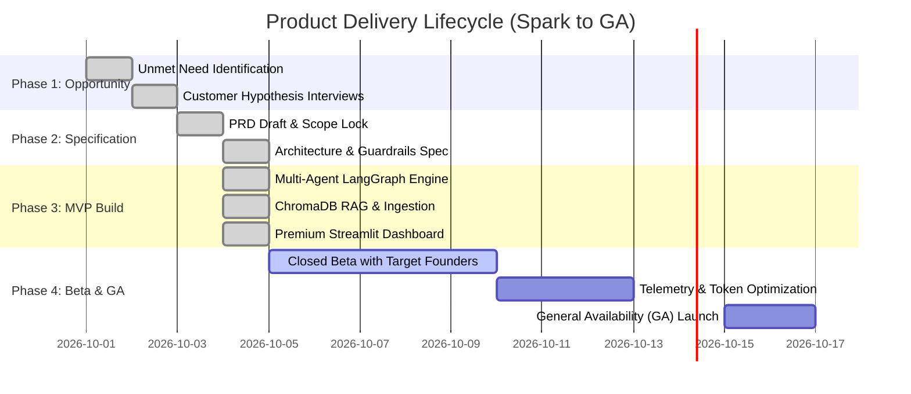

# 📋 Product Requirements Document (PRD)
## Autonomous AI Business Analyst — NovaMart Intelligence

> **Framework:** Based on Prof. Naeem Zafar's *"From Opportunity to Solution: The AI Startup Recipe"* (UC Berkeley / Northeastern University)  
> **Author:** Antigravity AI Engineering & Business Analysis Team  
> **Version:** 1.0 (MVP Release)  
> **Status:** Approved for Implementation  
> **Target Timeline:** Rapid 1–2 Week Delivery (2-Day Hackathon MVP Scope Lock)  

---

## 1. Executive Summary & Document Purpose

As established in Prof. Naeem Zafar’s *AI Startup Recipe*, moving prematurely from an idea straight into code is a fatal trap leading to scope creep, unguided execution, and high burn rates. A Product Requirements Document (PRD) serves as the **shared blueprint and single source of truth** aligning Product, Design, and Engineering on:
- **Why** we are building this product (the unmet need and business opportunity).
- **What** value it delivers (user flows, functional specifications, and AI guardrails).
- **What is explicitly deferred** (ruthless scope control).
- **How success is measured** (concrete ROI and impact metrics).

The **Autonomous AI Business Analyst** is an enterprise-grade multi-agent analytics platform that allows non-technical business leaders (Founders, CFOs, Operations Directors) to ask natural language questions about performance anomalies, receive deterministic calculation-backed root-cause analysis, cross-reference internal operational knowledge, and obtain validated executive recommendations without writing SQL or relying on hallucinated LLM arithmetic.

---

## 2. Problem Statement & Opportunity Validation

### 2.1 The Unmet Need & "Pain Worth Paying For"
Modern business executives face a major dilemma when revenue drops or operational anomalies occur:
1. **The BI Dashboard Paralysis:** Dashboards (Tableau, PowerBI) display *what* happened (e.g., revenue is down 15.8%), but fail to explain *why* or connect numbers to qualitative business context (e.g., supply chain stockouts, distributor changes).
2. **The Human Analyst Bottleneck:** Requesting a deep-dive diagnosis from a data team requires SQL ticketing, taking **3 to 7 business days** per inquiry.
3. **The "LLM Wrapper" Hallucination Trap:** Off-the-shelf LLMs cannot be trusted with business arithmetic. They frequently hallucinate numbers, mistake correlation for causation, and act as unreliable "black boxes."

### 2.2 Target User Personas
- **Primary Persona — "The Resource-Constrained Founder / CEO":** Needs rapid, audit-ready operational clarity before board meetings without hiring a $150k/year data team.
- **Secondary Persona — "The Finance & Commercial Director (CFO/VP Sales)":** Requires deterministic financial reconciliation, period-over-period comparisons, and evidence citations before presenting figures.
- **Tertiary Persona — "The Regional Operations Manager":** Needs to evaluate regional performance against documented policies and targets.

### 2.3 Core Hypotheses & Proof-Points
| Hypothesis to Test | Validation Proof-Point |
| :--- | :--- |
| Non-technical executives prefer a multi-agent analytical conversation over static dashboards. | >75% of beta users resolve multi-variable business questions in <60 seconds without manual filtering. |
| Trust requires separating calculation from generative synthesis. | 100% of numerical metrics match underlying CSV/Excel source records. |
| Critic validation increases executive adoption. | Users rate confidence 4.5/5+ when reports explicitly separate facts from plausible hypotheses. |

---

## 3. Product Vision & The "1 Killer Feature"

### 3.1 The Killer Feature (Ruthless Focus)
> **Autonomous Multi-Agent Root-Cause Analysis with Deterministic Calculations & Evidence Provenance.**

The product behaves like a virtual analytics department:
1. **Supervisor** creates a structured plan.
2. **Data Analyst** computes exact Pandas arithmetic (zero LLM math).
3. **RAG Agent** extracts operational context from internal documents (PDFs, DOCX).
4. **Critic Agent** audits claims, prevents causal leaps, and demands re-planning if needed.
5. **Executive Report Agent** delivers structured briefing cards, interactive Plotly visualizations, citations, and prioritized action items.

### 3.2 Business Model & Unit Economics
- **Business Model:** Tiered B2B SaaS (Free Tier: 1 user, local data; Pro Tier: $99/month per workspace; Enterprise: $499/month with custom document vectorization).
- **Unit Economics Target:**
  - Gemini 2.5 Flash token cost per executive inquiry: **< $0.005**.
  - Local/in-memory ChromaDB vector search cost: **$0.00**.
  - Target Gross Margin: **> 85%**.

---

## 4. Scope Control: V1 MVP vs. V2 Roadmap

Per Naeem Zafar's *Scope Control Recipe*, solopreneurs and hackathon teams must ruthlessly cut secondary features to ship in days rather than months.

```
┌─────────────────────────────────────────────────────────────┐
│                       SCOPE MATRIX                          │
├──────────────────────────────┬──────────────────────────────┤
│      V1.0 MUST-HAVE (MVP)    │     V2.0 OUT-OF-SCOPE        │
├──────────────────────────────┼──────────────────────────────┤
│ • Streamlit Web UI           │ • SQL generation & live DBs  │
│ • Gemini 2.5 Flash + Fallback│ • DuckDB / Data warehouses   │
│ • LangGraph 5-Agent Pipeline │ • Real-time web scraping     │
│ • Deterministic Pandas Layer │ • External macro API calls   │
│ • ChromaDB RAG Vector Store  │ • User authentication/RBAC   │
│ • CSV/Excel Sales Upload     │ • Multi-tenant cloud billing │
│ • PDF/DOCX Document Upload   │ • Automated Slack/Jira bots  │
│ • 11 Interactive Plotly Visuals│ • Long-term stateful memory│
│ • Fact vs. Hypothesis Audit  │ • Mobile Native Application  │
│ • JSON/Markdown/CSV Export   │ • Paid GPU hosting overhead  │
└──────────────────────────────┴──────────────────────────────┘
```

---

## 5. Functional Requirements & User Experience

### 5.1 User Journey
```text
[Business User] 
       │
       ▼ (1. Inputs question or clicks quick-prompt)
[Streamlit Frontend] 
       │
       ▼ (2. Dispatches inquiry to LangGraph StateGraph)
[Supervisor Agent] ──▶ Formulates multi-step analytical plan
       │
       ├─▶ [Data Analyst Agent] ──▶ Runs Pandas calculations (No LLM math)
       │
       ├─▶ [RAG Knowledge Agent] ──▶ Queries ChromaDB for policy & memo context
       │
       ▼
[Critic Agent] ──▶ Audits evidence; rewrites causal overreaches; can trigger re-plan
       │
       ▼ (Validated findings)
[Executive Report Agent] ──▶ Synthesizes executive briefing
       │
       ▼ (3. Renders rich UI)
[Interactive Dashboard]
  • Executive Briefing & Confidence Score
  • 4 KPI Summary Cards with Deltas
  • 11 Plotly Visualization Tabs
  • Factual Findings vs. Plausible Hypotheses Cards
  • Prioritized Management Recommendations (Owner, Action, Rationale)
  • Traceable Document Citations & Audit Log
  • Multi-Format Export (JSON, Markdown, CSV)
```

### 5.2 Input Specifications
- **Natural Language Inquiry:** Free-form text or one-click preset queries.
- **Structured Data Upload:** CSV or Excel (`.csv`, `.xlsx`, `.xls`) with automated schema normalization, missing value handling, and revenue calculations.
- **Unstructured Knowledge Upload:** PDF or Word (`.pdf`, `.docx`) with automated text extraction, chunking, and ChromaDB vector indexing.

### 5.3 Output Specifications
- **Deterministic Metrics:** Net Revenue, Order Counts, Average Order Value (AOV), Repeat Customer Rate, Growth Decomposition, Anomaly Z-scores.
- **Evidence Trail:** Every metric backed by tool execution; every corporate claim backed by document filename and page/chunk ID.

---

## 6. AI-Specific Requirements & Risk Mitigation

Adhering strictly to Pages 14, 26, and 27 of Naeem Zafar's *AI Startup Recipe*, AI applications must explicitly design specs for non-deterministic risks:

| AI Risk Area | Threat / Pitfall | Spec Requirement & Architectural Mitigation |
| :--- | :--- | :--- |
| **Output Reliability** | LLMs hallucinate numbers or calculate percentages incorrectly. | **Zero LLM Arithmetic Rule:** All mathematical operations are calculated in 100% deterministic Python/Pandas tools. The LLM only receives and interprets pre-calculated numbers. |
| **Causal Leaps** | Correlation mistaken for causation (e.g., "distributor transition caused the decline"). | **Mandatory Critic Node:** Critic agent audits all draft findings. If a document only mentions coincident timing without causal proof, the claim is rewritten as a *plausible hypothesis* rather than a proven fact. |
| **Black-Box Skepticism** | Executives do not trust unexplainable AI outputs. | **Transparent Telemetry & Audit Trace:** Live execution pipeline visibly reveals which agent executed, tool duration, exact parameters, and full citation provenance. |
| **Vendor Downtime & Rate Limits** | Gemini API outages or quota throttling stalls the app. | **Dual-Model Fallback & Offline Mode:** Primary engine is `gemini-2.5-flash`; automatically falls back to `gemini-2.5-flash-lite`. If offline, deterministic analytics and rule-based synthesis continue operating seamlessly. |
| **Compute & Token Costs** | Unbounded prompt growth explodes operational costs. | **Context Optimization:** Raw dataframes are never injected into the LLM context. Only structured JSON summaries of tool results are passed to agents. |

---

## 7. Success Metrics & Impact KPIs

In accordance with Naeem Zafar's telemetry recommendations, the product monitors both business impact and technical health:

### 7.1 Business Impact KPIs
- **Decision Acceleration:** Time to diagnose quarterly performance drops reduced from **72 hours** (human data team) to **< 30 seconds**.
- **Self-Service Resolution Rate:** > 80% of executive queries answered without engineering intervention.
- **Recommendation Actionability:** 4 prioritized recommendations per report with explicit owner, priority, and rationale.

### 7.2 Technical & AI Telemetry
- **Deterministic Accuracy:** 100% agreement between tool output and report text.
- **Hallucination Rate:** 0% invented transaction metrics.
- **Execution Latency:** End-to-end multi-agent pipeline completes in **< 15 seconds** locally.
- **Cost per Query:** < $0.01 in token usage.

---

## 8. Product Lifecycle Roadmap (Spark to GA)

Following the 8-step venture roadmap defined in Naeem Zafar's framework:



---

## 9. Sign-off & Alignment

- **Product Management:** Approved (Aligns with V1 Scope Lock & ROI focus)  
- **Lead AI Engineer:** Approved (Deterministic Pandas + LangGraph Multi-Agent Architecture)  
- **Venture Advisor:** Approved (Addresses Naeem Zafar's "Pain Worth Paying For" criteria)  
