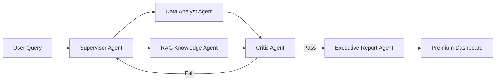

# 🧠 NovaMart AI Business Analyst

### Autonomous Multi-Agent Executive Analytics Platform

> **Hackathon-Winning** enterprise-grade AI Business Analyst that coordinates 5 specialist agents to answer complex business questions with deterministic arithmetic, evidence-backed citations, and Critic validated insights.

---

## 🏆 Key Differentiators

| Feature | Description |
|---|---|
| **🤖 5-Agent LangGraph Pipeline** | Supervisor → Data Analyst → RAG Agent → Critic → Executive Report |
| **📊 100% Deterministic Analytics** | All calculations via Pandas — LLMs never do mental math |
| **🔍 Critic Agent** | Rejects causal leaps, distinguishes correlation from causation |
| **📚 RAG Knowledge Base** | ChromaDB-powered semantic search over 8 corporate PDFs |
| **📈 11 Premium Visualizations** | Geo-heatmap, RFM segmentation, forecast, growth waterfall |
| **⚡ Zero-Cost Deployment** | Runs on Streamlit Community Cloud with graceful offline mode |

---

## 🎨 Premium Dashboard

- **Dark glassmorphism** design with animated gradient backgrounds
- **Interactive agent pipeline** visualization showing execution flow
- **11 visualization tabs**: Revenue trend, Regional, Categories, Period Comparison, Anomalies, Geo Map, Customer RFM, Growth Decomposition, Forecast, KPI Dashboard, Quarterly Trends
- **Premium metric cards** with delta indicators
- **Export to JSON, Markdown, and CSV** trace logs

---

## 🧩 Architecture



### Agent Roles

| Agent | Responsibility |
|---|---|
| **Supervisor** | Decomposes questions, creates analytical plans, coordinates re-planning |
| **Data Analyst** | Executes deterministic Pandas calculations (KPIs, comparisons, anomalies) |
| **RAG Analyst** | Searches corporate knowledge base via ChromaDB semantic search |
| **Critic** | Validates evidence, rejects unsupported causal assertions, calibrates confidence |
| **Executive Report** | Synthesizes findings into structured, CEO-ready deliverables |

---

## 🛠️ Technology Stack

- **AI Engine**: Google Gemini 2.5 Flash (with fallback)
- **Multi-Agent Framework**: LangGraph (StateGraph with conditional edges)
- **Analytics**: Pandas, NumPy, Scikit-learn
- **Vector Database**: ChromaDB (with in-memory fallback)
- **Visualization**: Plotly (premium dark theme)
- **Frontend**: Streamlit (glassmorphism dark mode)
- **Embeddings**: Gemini Embedding API (with hash-based offline fallback)

---

## 📁 Project Structure

```
├── app/
│   ├── agents/          # 5 specialist agents
│   │   ├── supervisor.py
│   │   ├── data_analyst.py
│   │   ├── rag_analyst.py
│   │   ├── critic.py
│   │   └── executive_report.py
│   ├── graph/           # LangGraph workflow
│   │   ├── workflow.py
│   │   └── state.py
│   ├── tools/           # Deterministic analytics & charts
│   │   ├── analytics.py # 18+ analytical tools
│   │   ├── charts.py    # 11 premium visualizations
│   │   └── rag.py       # Knowledge search tools
│   ├── rag/             # Vector store & document ingestion
│   ├── models/          # Pydantic data models
│   ├── services/        # Gemini API service
│   ├── prompts/         # Agent prompts
│   └── utils/           # Logging, formatting, security
├── frontend/
│   └── streamlit_app.py # Premium dashboard
├── data/
│   ├── raw/             # Original Excel dataset
│   └── processed/       # Cleaned CSV tables
├── knowledge/           # 8 corporate governance PDFs
├── chroma_db/           # Vector store persistence
├── .streamlit/          # Streamlit configuration
└── requirements.txt
```

---

## 🚀 Quick Start

### 1. Clone & Install
```bash
git clone <repository-url>
cd Autonomous_Business_Analyst
pip install -r requirements.txt
```

### 2. Configure
```bash
cp .env.example .env
# Add your GEMINI_API_KEY to .env
```

### 3. Prepare Data
```bash
python scripts/prepare_dataset.py
```

### 4. Run Dashboard
```bash
streamlit run frontend/streamlit_app.py
```

---

## 📊 Enhanced Analytics Tools (v2.0)

| Tool | Description |
|---|---|
| `calculate_total_revenue` | Revenue with filters by period, country, category |
| `compare_periods` | Period-over-period comparison with dimensional breakdown |
| `revenue_by_country` | Country-level revenue breakdown with market share |
| `revenue_by_category` | Category performance analysis |
| `top_products` / `bottom_products` | Product ranking by revenue |
| `customer_metrics` | Active customers, repeat rate, loyalty |
| `detect_anomalies` | Statistical anomaly detection (>2σ) |
| **`rfm_segmentation`** | RFM customer value segmentation |
| **`revenue_forecast`** | Linear trend projection with R² |
| **`growth_decomposition`** | Volume vs Price/Mix growth drivers |
| **`monthly_kpi_dashboard`** | Monthly sparkline KPI data |
| **`country_performance_matrix`** | Geo-heatmap ready data |
| **`quarterly_executive_summary`** | Quarterly metrics with QoQ growth |

---

## 📄 License

MIT License

---

*Built for Hackathon • Zero-Cost Cloud Deployment • Gemini + LangGraph + Pandas + ChromaDB*
